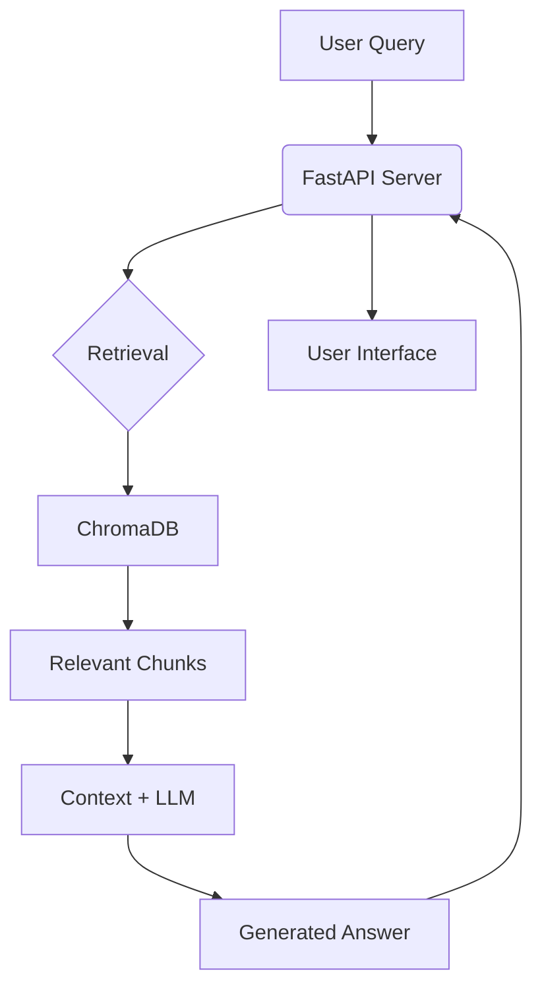

# Local RAG Chatbot


## What is this?

**Local RAG Chatbot** is a production-ready template for building Retrieval-Augmented Generation (RAG) applications. It allows users to chat with their own documents (PDFs, TXT, MD, CSV) entirely locally or by using popular cloud-based AI providers.

The project is designed to be flexible, supporting multiple embedding and chat models, a persistent vector store, and a modern web-based UI.

### Key Features

- **Multi-Provider Support**: Seamlessly switch between **Ollama** (fully local), **OpenAI**, and **Google AI (Gemini)**.
- **Robust Document Loading**: Intelligent loaders for PDF, Markdown, Text, and CSV files, with graceful error handling and encoding detection.
- **Persistent Vector Store**: Uses **ChromaDB** to store document embeddings, with separate storage paths for each provider.
- **Modern Web Interface**: A reactive frontend built with **React** and **Vite** for a sleek user experience.
- **Production Ready**: Built with **FastAPI** for high performance and easy deployment.

## Architecture Overview

The system follows a classic RAG architecture:

1.  **Ingestion**: Documents are loaded from the `data/` directory, chunked using `RecursiveCharacterTextSplitter`, and embedded using the selected provider.
2.  **Storage**: Embeddings are stored in **ChromaDB**.
3.  **Retrieval**: When a user asks a question, the system retrieves the most relevant document chunks.
4.  **Generation**: The retrieved chunks are passed as context to a Language Model (LLM), which generates an answer based *only* on that context.



---

## Setup Instructions

1. **Download and install Ollama**  
   Follow instructions from [Ollama’s official site](https://ollama.com/).

2. **Download models**

   **Full version:**
   ```bash
   ollama pull llama3.1:8b
   ollama pull nomic-embed-text
   ```

   **Light version:**
   ```bash
   ollama pull llama3.1:8b-instruct-q4_K_M
   ```

3. **Setup Python environment**
   ```bash
   cd C:\dev\github\code-bot
   python -m venv venv
   venv\Scripts\activate
   pip install -r requirements.txt
   ```

4. **Sync the `requirements.txt` (optional)**
   ```bash
   pip install pip-tools
   pip-sync requirements.txt
   pip install -r requirements.txt
   ```

5. **Configure Environment**
   Create a `.env` file (or edit `app/config.py` defaults).

   **For Ollama (Default):**
   ```env
   EMBEDDING_PROVIDER=ollama
   # OLLAMA_BASE_URL=http://localhost:11434 (default)
   ```

   **For OpenAI:**
   ```env
   EMBEDDING_PROVIDER=openai
   OPENAI_API_KEY=sk-...
   ```

   **For Google AI:**
   ```env
   EMBEDDING_PROVIDER=google
   GOOGLE_API_KEY=AIza...
   ```

6. **Build the index**
   Run the build script. It will use the `EMBEDDING_PROVIDER` set in your environment.
   
   **Windows (PowerShell):**
   ```powershell
   $env:EMBEDDING_PROVIDER="ollama" # or "openai", "google"
   python -m app.build_index
   ```

   **Linux/Mac:**
   ```bash
   export EMBEDDING_PROVIDER=ollama # or openai, google
   python -m app.build_index
   ```

7. **Verify the index**
   ```bash
   # Example for Google AI index
   python -c "import chromadb; client = chromadb.PersistentClient(path='chroma_googleai'); print('Collection count:', client.get_collection('local-rag').count())"
   ```

8. **Run the server**
   ```bash
   uvicorn app.main:app --reload
   ```

9. **Test the health endpoint**
    *(No UI required, just the FastAPI server running)*

    **Linux/Mac/PowerShell:**
    ```bash
    curl http://127.0.0.1:8000/health
    ```

    **Windows (PowerShell Native):**
    ```powershell
    Invoke-RestMethod -Uri "http://127.0.0.1:8000/health"
    ```
    # expected output: {"status":"ok"}

10. **Test chat**
    
    **Linux/Mac (or Git Bash):**
    ```bash
    curl -X POST http://127.0.0.1:8000/chat \
         -H "Content-Type: application/json" \
         -d "{\"query\":\"What is Project Alpha?\"}"
    ```

    **Windows (PowerShell):**
    ```powershell
    Invoke-RestMethod -Uri "http://127.0.0.1:8000/chat" `
                     -Method Post `
                     -ContentType "application/json" `
                     -Body '{"query": "What is Project Alpha?"}'
    ```

11. **Use Web UI**
    ```bash
    cd C:\dev\github\code-bot\local-rag-ui
    npm install
    npm run dev
    ```
    # Go to browser with this URL: http://localhost:5173/

12. **Stop the app**
    ```powershell
    taskkill /F /IM uvicorn.exe /T; taskkill /F /IM python.exe /T; Get-Process | Where-Object { $_.ProcessName -like "*node*" } | Stop-Process -Force -ErrorAction SilentlyContinue
    ```

---

## Switching Providers

The app supports multiple providers. You can switch between them by changing the `EMBEDDING_PROVIDER` environment variable (or in `.env`).  
Each provider has its own ChromaDB persistence directory, so you must **build the index** for each provider you intend to use.

- **Ollama**: `chroma_db_ollama`
- **OpenAI**: `chroma_db_openai`
- **Google**: `chroma_googleai`

