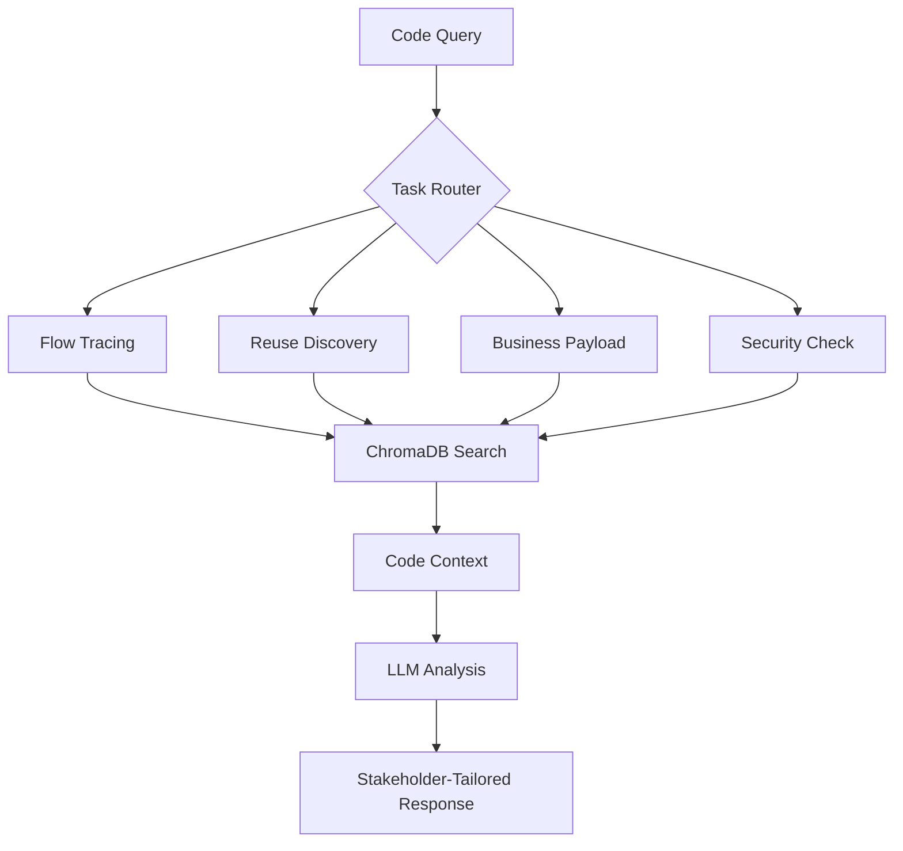

# Universal Code Intelligence Engine


## What is this?

**Universal Code Intelligence Engine** is a specialized RAG-powered system for deep source code analysis and architectural understanding. It enables developers, architects, and business stakeholders to chat with their codebases using natural language, providing contextual insights about code flows, reusable components, business logic, and security patterns.

The system is designed specifically for enterprise codebases, with intelligent parsing of Java, Python, XML, YAML, and configuration files.

### Key Capabilities

- **Flow Tracing**: Trace request paths through controllers → filters → services → repositories with DTO/config analysis
- **Reuse Discovery**: Find existing functions, utilities, and components with purpose and location details
- **Business Payload Analysis**: Understand response structures and data flows from DTOs/mappers/controllers
- **Security Assessment**: Analyze authentication, authorization, validation, and security patterns
- **Multi-Provider Support**: Seamlessly switch between **Ollama** (fully local), **OpenAI**, and **Google AI (Gemini)**
- **Enterprise-Ready**: Handles complex multi-module projects with Maven/Gradle builds

## Architecture Overview

The system follows a specialized RAG architecture for code intelligence:

1.  **Code Ingestion**: Source files (.java, .py, .xml, .yml, pom.xml, etc.) are loaded from project directories, intelligently parsed to remove comments/noise, and chunked using language-aware splitters
2.  **Vector Storage**: Code embeddings are stored in **ChromaDB** with metadata about project, file type, and location
3.  **Intelligent Retrieval**: Queries are matched against relevant code segments using semantic similarity (k=5 by default)
4.  **Code Analysis**: Retrieved code context is analyzed through specialized task routers for flow tracing, component discovery, or security assessment
5.  **Contextual Response**: Tailored insights are generated based on stakeholder type (developer/architect/business/security)



---

## Setup Instructions

### 1. Directory Structure Setup
Create the data directory structure for your code projects:
```bash
# Create sibling directory for code projects and vector databases
mkdir ../code-bot-data
mkdir ../code-bot-data/data
mkdir ../code-bot-data/data/my-project1
mkdir ../code-bot-data/data/my-project2
# Vector DBs will be auto-created in ../code-bot-data/vector-db/
```

### 2. Add Your Code Projects
Place your source code projects in the data directory:
```
../code-bot-data/data/
├── spring-boot-app/          # Java/Spring project
│   ├── src/main/java/
│   ├── pom.xml
│   └── application.yml
├── python-service/           # Python project  
│   ├── app/
│   ├── requirements.txt
│   └── config.yaml
└── microservice-config/      # Configuration files
    ├── docker-compose.yml
    └── k8s-manifests/
```

### 3. Download and install Ollama  
   Follow instructions from [Ollama’s official site](https://ollama.com/).

### 4. Download models

   **Full version:**
   ```bash
   ollama pull llama3.1:8b
   ollama pull nomic-embed-text
   ```

   **Light version:**
   ```bash
   ollama pull llama3.1:8b-instruct-q4_K_M
   ```

### 5. Setup Python environment
   ```bash
   cd C:\dev\github\code-bot
   python -m venv venv
   venv\Scripts\activate
   pip install -r requirements.txt
   ```

### 6. Configure Environment
   The `.env` file is already configured for the new directory structure:

   **For Google AI (Recommended):**
   ```env
   EMBEDDING_PROVIDER=google
   GOOGLE_API_KEY=your_google_api_key_here
   DATA_DIR=../code-bot-data/data
   ```

   **For Ollama (Local):**
   ```env
   EMBEDDING_PROVIDER=ollama
   DATA_DIR=../code-bot-data/data
   ```

   **For OpenAI:**
   ```env
   EMBEDDING_PROVIDER=openai
   OPENAI_API_KEY=sk-your_key_here
   DATA_DIR=../code-bot-data/data
   ```

### 7. Build the code index
   Run the build script to index your source code projects:
   
   **Windows (PowerShell):**
   ```powershell
   $env:EMBEDDING_PROVIDER="google"  # or "ollama", "openai"
   python -m app.build_index
   ```

   **Linux/Mac:**
   ```bash
   export EMBEDDING_PROVIDER=google  # or ollama, openai
   python -m app.build_index
   ```

### 8. Verify the index
   ```bash
   # Example for Google AI index
   python -c "import chromadb; client = chromadb.PersistentClient(path='../code-bot-data/vector-db/chroma_googleai'); print('Collection count:', client.get_collection('local-rag').count())"
   ```

### 9. Run the server
   ```bash
   uvicorn app.main:app --reload
   ```

### 10. Test the health endpoint
    *(No UI required, just the FastAPI server running)*

    **Linux/Mac/PowerShell:**
    ```bash
    curl http://127.0.0.1:8000/health
    ```

    **Windows (PowerShell Native):**
    ```powershell
    Invoke-RestMethod -Uri "http://127.0.0.1:8000/health"
    ```
    # expected output: {"status":"ok"}

### 11. Test code analysis
    
    **Example queries for Java/Spring projects:**
    ```bash
    curl -X POST http://127.0.0.1:8000/chat \
         -H "Content-Type: application/json" \
         -d '{"query":"How does user authentication work in this system?"}'
    ```

    **Example queries for architecture analysis:**
    ```bash
    curl -X POST http://127.0.0.1:8000/chat \
         -H "Content-Type: application/json" \
         -d '{"query":"Trace the request flow from controller to database"}'
    ```

    **Windows (PowerShell):**
    ```powershell
    Invoke-RestMethod -Uri "http://127.0.0.1:8000/chat" `
                     -Method Post `
                     -ContentType "application/json" `
                     -Body '{"query": "What security vulnerabilities exist in the authentication flow?"}'
    ```

### 12. Use Web UI
    ```bash
    cd C:\dev\github\code-bot\local-rag-ui
    npm install
    npm run dev
    ```
    # Go to browser with this URL: http://localhost:5173/

### 13. Stop the app
    ```powershell
    taskkill /F /IM uvicorn.exe /T; taskkill /F /IM python.exe /T; Get-Process | Where-Object { $_.ProcessName -like "*node*" } | Stop-Process -Force -ErrorAction SilentlyContinue
    ```

---

## Switching Providers

The system supports multiple embedding providers. Each provider has its own vector database directory:

- **Google AI**: `../code-bot-data/vector-db/chroma_googleai/` (Recommended)
- **Ollama**: `../code-bot-data/vector-db/chroma_ollama/` (Local/Private)  
- **OpenAI**: `../code-bot-data/vector-db/chroma_openai/` (Alternative cloud)

You must **build the index** for each provider you intend to use, as embeddings are not compatible between providers.

## Example Use Cases

**For Developers:**
- "Find all methods that handle user authentication"
- "Show me how payment processing is implemented"  
- "What utility functions are available for date formatting?"

**For Architects:**
- "Analyze the security posture of the authentication system"
- "What are the dependencies between these microservices?"
- "Trace the data flow from API to database"

**For Business Stakeholders:**
- "What business logic is implemented in the checkout process?"
- "How does the system handle customer data privacy?"
- "What APIs are exposed for third-party integration?"

